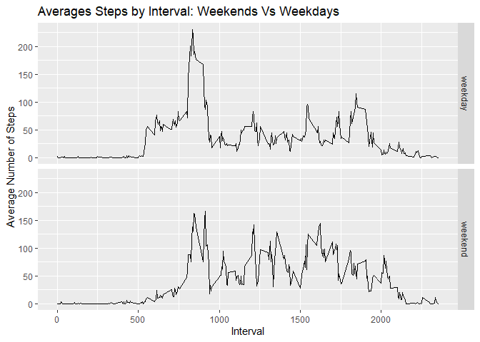

## Loading and preprocessing the data
First, we load the data set:


```r
activity <- read.csv("activity.csv")
```


## What is mean total number of steps taken per day?
We can use tapply and the sum() function to generate daily totals, from which
we can create a histogram:


```r
dailySteps <-tapply(activity$steps, activity$date, sum, na.rm = TRUE)
dailySteps
```

```
## 2012-10-01 2012-10-02 2012-10-03 2012-10-04 2012-10-05 2012-10-06 2012-10-07 
##          0        126      11352      12116      13294      15420      11015 
## 2012-10-08 2012-10-09 2012-10-10 2012-10-11 2012-10-12 2012-10-13 2012-10-14 
##          0      12811       9900      10304      17382      12426      15098 
## 2012-10-15 2012-10-16 2012-10-17 2012-10-18 2012-10-19 2012-10-20 2012-10-21 
##      10139      15084      13452      10056      11829      10395       8821 
## 2012-10-22 2012-10-23 2012-10-24 2012-10-25 2012-10-26 2012-10-27 2012-10-28 
##      13460       8918       8355       2492       6778      10119      11458 
## 2012-10-29 2012-10-30 2012-10-31 2012-11-01 2012-11-02 2012-11-03 2012-11-04 
##       5018       9819      15414          0      10600      10571          0 
## 2012-11-05 2012-11-06 2012-11-07 2012-11-08 2012-11-09 2012-11-10 2012-11-11 
##      10439       8334      12883       3219          0          0      12608 
## 2012-11-12 2012-11-13 2012-11-14 2012-11-15 2012-11-16 2012-11-17 2012-11-18 
##      10765       7336          0         41       5441      14339      15110 
## 2012-11-19 2012-11-20 2012-11-21 2012-11-22 2012-11-23 2012-11-24 2012-11-25 
##       8841       4472      12787      20427      21194      14478      11834 
## 2012-11-26 2012-11-27 2012-11-28 2012-11-29 2012-11-30 
##      11162      13646      10183       7047          0
```

```r
hist(dailySteps, main = "Histogram of Daily Step Totals", xlab = "Daily Steps")
```

<!-- -->

We can also take the mean and median of total steps per day:


```r
mean(dailySteps)
```

```
## [1] 9354.23
```

```r
median(dailySteps)
```

```
## [1] 10395
```


## What is the average daily activity pattern?

What does a "typical day" look like? Let's average the steps by time interval
and plot as a time series:


```r
intervalAverages <-tapply(activity$steps, activity$interval, mean, na.rm = TRUE)
plot((names(intervalAverages)), intervalAverages, type = "l", xlab = "Time of Day",
     ylab = "Average Steps")
```

<!-- -->

The time of day with the highest average is **8:35 a.m.** :


```r
highestAvg <-intervalAverages[order(intervalAverages,decreasing = TRUE)[1]]
highestAvg
```

```
##      835 
## 206.1698
```


## Imputing missing values
2304 rows are missing data:


```r
nrow(activity[rowSums(is.na(activity))>0,])
```

```
## [1] 2304
```

To replace these, I started by extracting the rows with missing values:


```r
naRows <-activity[is.na(activity$steps),]
head(naRows)
```

```
##   steps       date interval
## 1    NA 2012-10-01        0
## 2    NA 2012-10-01        5
## 3    NA 2012-10-01       10
## 4    NA 2012-10-01       15
## 5    NA 2012-10-01       20
## 6    NA 2012-10-01       25
```

We're going to replace with the average steps value for that time interval. 

Recall, we already have this in intervalAverages.

I've created a (very narrow usage) function that takes a row number.

The function will:

1. Look up the time interval from column three of that row in naRow

2. Use that value to find the average from intervalAverages


```r
getAvg <- function(row) {
     time <- naRows[row,3]
     intervalAverages[as.character(time)]
}
```

We can quickly use sapply to run this over every row in naRows, creating our 
replacement set of the corresponding interval average for each NA value:


```r
replaceSet <-sapply(1:nrow(naRows), getAvg)
head(replaceSet)
```

```
##         0         5        10        15        20        25 
## 1.7169811 0.3396226 0.1320755 0.1509434 0.0754717 2.0943396
```

Now to plug that in and fix the original dataset. Since the set we created is in
the same order, it's rather simple:


```r
activity[is.na(activity$steps),1] <- replaceSet
```

How does our histogram, mean, and median look with these changes? Well, a lot
more mean-reverting:


```r
dailySteps <-tapply(activity$steps, activity$date, sum)
dailySteps
```

```
## 2012-10-01 2012-10-02 2012-10-03 2012-10-04 2012-10-05 2012-10-06 2012-10-07 
##   10766.19     126.00   11352.00   12116.00   13294.00   15420.00   11015.00 
## 2012-10-08 2012-10-09 2012-10-10 2012-10-11 2012-10-12 2012-10-13 2012-10-14 
##   10766.19   12811.00    9900.00   10304.00   17382.00   12426.00   15098.00 
## 2012-10-15 2012-10-16 2012-10-17 2012-10-18 2012-10-19 2012-10-20 2012-10-21 
##   10139.00   15084.00   13452.00   10056.00   11829.00   10395.00    8821.00 
## 2012-10-22 2012-10-23 2012-10-24 2012-10-25 2012-10-26 2012-10-27 2012-10-28 
##   13460.00    8918.00    8355.00    2492.00    6778.00   10119.00   11458.00 
## 2012-10-29 2012-10-30 2012-10-31 2012-11-01 2012-11-02 2012-11-03 2012-11-04 
##    5018.00    9819.00   15414.00   10766.19   10600.00   10571.00   10766.19 
## 2012-11-05 2012-11-06 2012-11-07 2012-11-08 2012-11-09 2012-11-10 2012-11-11 
##   10439.00    8334.00   12883.00    3219.00   10766.19   10766.19   12608.00 
## 2012-11-12 2012-11-13 2012-11-14 2012-11-15 2012-11-16 2012-11-17 2012-11-18 
##   10765.00    7336.00   10766.19      41.00    5441.00   14339.00   15110.00 
## 2012-11-19 2012-11-20 2012-11-21 2012-11-22 2012-11-23 2012-11-24 2012-11-25 
##    8841.00    4472.00   12787.00   20427.00   21194.00   14478.00   11834.00 
## 2012-11-26 2012-11-27 2012-11-28 2012-11-29 2012-11-30 
##   11162.00   13646.00   10183.00    7047.00   10766.19
```

```r
hist(dailySteps, main = "Histogram of Daily Step Totals", xlab = "Daily Steps")
```

<!-- -->

```r
mean(dailySteps)
```

```
## [1] 10766.19
```

```r
median(dailySteps)
```

```
## [1] 10766.19
```


## Are there differences in activity patterns between weekdays and weekends?

We create a factor variable with two levels -- weekday and weekend


```r
dayOfWeek <- sapply(as.Date(activity$date),weekdays)
dayOfWeek[dayOfWeek %in% c("Monday","Tuesday","Wednesday","Thursday","Friday")] <- "Weekday"
dayOfWeek[dayOfWeek %in% c("Saturday","Sunday")] <- "Weekend"
weekDayOrEnd <- as.factor(dayOfWeek)
activity <-cbind(activity, weekDayOrEnd)
head(activity)
```

```
##       steps       date interval weekDayOrEnd
## 1 1.7169811 2012-10-01        0      Weekday
## 2 0.3396226 2012-10-01        5      Weekday
## 3 0.1320755 2012-10-01       10      Weekday
## 4 0.1509434 2012-10-01       15      Weekday
## 5 0.0754717 2012-10-01       20      Weekday
## 6 2.0943396 2012-10-01       25      Weekday
```

Next, we'll separate the weekend and weekday data:


```r
weekendData <- activity[weekDayOrEnd=="Weekend",]
weekdayData <- activity[weekDayOrEnd=="Weekday",]
```

With our data separated, we can aggregate. We'll do weekday first.

I create a data frame of the aggregate data, and add a column that signifies it to 
be a weekday (this will come in handy later!)


```r
stepsWeekday <- aggregate(weekdayData$steps,list(weekdayData$interval),mean, na.rm =TRUE)
weekdayLabel <- rep("weekday",times = nrow(stepsWeekday))
stepsWeekday <- cbind(stepsWeekday, weekdayLabel)
head(stepsWeekday)
```

```
##   Group.1          x weekdayLabel
## 1       0 2.25115304      weekday
## 2       5 0.44528302      weekday
## 3      10 0.17316562      weekday
## 4      15 0.19790356      weekday
## 5      20 0.09895178      weekday
## 6      25 1.59035639      weekday
```

The process is identical for the weekend data:


```r
stepsWeekend <- aggregate(weekendData$steps,list(weekendData$interval),mean, na.rm =TRUE)
weekendLabel <- rep("weekend",times = nrow(stepsWeekend))
stepsWeekend <- cbind(stepsWeekend, weekendLabel)
head(stepsWeekend)
```

```
##   Group.1           x weekendLabel
## 1       0 0.214622642      weekend
## 2       5 0.042452830      weekend
## 3      10 0.016509434      weekend
## 4      15 0.018867925      weekend
## 5      20 0.009433962      weekend
## 6      25 3.511792453      weekend
```

With both made, we'll give them synced up variable names so we can rbind:


```r
names(stepsWeekend) <- c("Interval","Steps","day_or_end")
names(stepsWeekday) <- c("Interval","Steps","day_or_end")
weeksData <- rbind(stepsWeekday, stepsWeekend)
```

Finally, we need to make the variable *day_or_end* a factor so that we can panel. 
Then we can plot using ggplot2! 


```r
weeksData$day_or_end <- as.factor(weeksData$day_or_end)
library(ggplot2)
ggWeek <- ggplot(weeksData, aes(x = Interval, y = Steps)) + geom_line() + 
          ylab("Average Number of Steps") + xlab("Interval") + 
          ggtitle("Averages Steps by Interval: Weekends Vs Weekdays") + 
          facet_grid(weeksData$day_or_end)
ggWeek
```

<!-- -->
